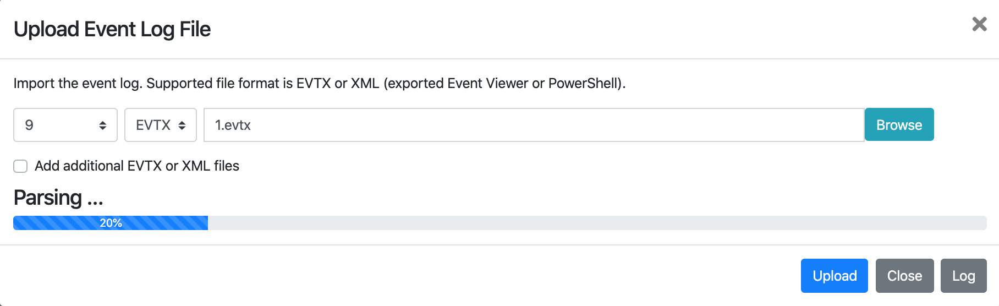
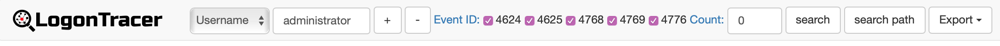
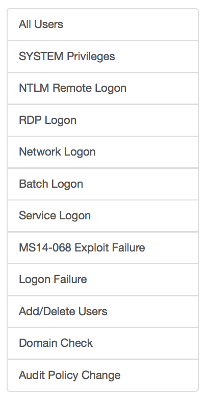

# LogonTracer
  Investigate malicious logon by visualizing and analyzing Windows active directory event logs.  
  LogonTracer uses [PageRank](https://en.wikipedia.org/wiki/PageRank) and [ChangeFinder](https://pdfs.semanticscholar.org/c5bc/7ca31914d3cdfe1b2932cbc779875e645bbb.pdf) to detect malicious hosts and accounts from event log.  
  This tool can visualize the following event id related to Windows logon based on [this research](https://www.first.org/resources/papers/conf2016/FIRST-2016-105.pdf).  
  * **4624**: Successful logon  
  * **4625**: Logon failure  
  * **4768**: Kerberos Authentication (TGT Request)  
  * **4769**: Kerberos Service Ticket (ST Request)  
  * **4776**: NTLM Authentication  
  * **4672**: Assign special privileges  

  

## Requirements
  The following tools are used

  * Python 3
  * [Neo4j](https://neo4j.com) for a graph database.  
  * [Neo4j JavaScript driver](https://github.com/neo4j/neo4j-javascript-driver) for connects to Neo4j using the binary protocol.  
  * [Cytoscape](http://www.cytoscape.org/) for visualizing a graph network.
  * [Flask](http://flask.pocoo.org/) is a microframework for Python.

## Usage
### Install
1. Download and install [Neo4j community edition](https://neo4j.com/download/).  

2. Clone or download LogonTracer.  
  ```shell
  $ git clone https://github.com/JPCERTCC/LogonTracer.git
  ```  

3. Install [Neo4j JavaScript driver](https://github.com/neo4j/neo4j-javascript-driver) to **static** directory.  
  ```shell
  $ cd LogonTracer/static
  $ npm install neo4j-driver
  ```  

4. Install Python modules.  
  ```shell
  $ pip3 install -r requirements.txt
  ```  
  or  
  ```shell
  $ pip3 install numpy py2neo python-evtx lxml changefinder flask
  ```  
  If statsmodels installation fails, install numpy first.  

5. Start the Neo4j server.  

### How to Use
#### Start LogonTracer
  Start LogonTracer by the following command option **-r**.  
  Use -h to see help message.  
  ```shell
  $ python3 logontracer.py -r -o 8080 -u neo4j -p password -s localhost
  ```  
  Access **http://[LogonTracer_Server]:8080/** via Web browser.  
#### Import EVTX
  Import the event log using **Web GUI** or **logontracer.py**.  
##### Use Web GUI
  Event log can be imported with upload EVTX button.  
  
##### Use python script
  Event log can be imported by logontracer.py option **-e**.  
  ```shell
  $ python3 logontracer.py -e Security.evtx -z +9 -u neo4j -p password -s localhost
  ```
#### Search and visualize the event log
  Using the navigation bar to search for account name, host name, IP address, event id and event count.  
  Export button can download graph data of CSV, JPG, PNG and JSON.  
    
  Using the side-bar to search for account names matching specific criteria.  
  
  * All users: Visualizing all users and hosts.  
  * SYSTEM privileges: Visualizing users with system privileges.  
  * RDP Logon: Visualizing RDP logon users and hosts (Logon type: 10).  
  * Network Logon: Visualizing logon users and hosts  from remote network (Logon type: 3).  
  * Batch Logon: Visualizing batch server logon (Logon type: 4).  
  * Service Logon: Visualizing Services Control Manager logon (Logon type: 5).  
  * ms14-068 exploit failure: Visualizing the error log that the ms14-068 exploit failed.  
  * Logon failure: Visualizing users who failed to log on.  

##### Node details
  *  SYSTEM privileges account  
  *  Standard user account  
  *  IP address and host  

#### PageRank
  PageRank is an algorithm for checking the importance of web pages.  
  LogonTracer uses PageRank to examine the importance of accounts and hosts in a domain network.  
  An account with high PageRank logs on to many hosts and may be used by the attackers' lateral movement.  
  

#### Timeline
  Timeline button displays hourly event log counts in time series.  
  Hosts with drastic changes are highlighted.  
  For anomaly detection using this index, use change point analysis algorithm Change Finder.  
  For downloading timeline summary and detailed CSV data, click "Download".  
  

## Docker Image
  If you are using Docker, you can pull the following image.  
  https://hub.docker.com/r/jpcertcc/docker-logontracer/

  ```shell
  $ docker run \
     --detach \
     --publish=7474:7474 --publish=7687:7687 --publish=8080:8080 \
     -e LTHOSTNAME=[IP Address] \
     jpcertcc/docker-logontracer
  ```

## Notes
 Event logs that LogonTracer analyzes are not recorded by default settings.  
 If you have not enabled the audit policy, you need to enable the audit policy.  
 You can change the audit policy from Local Group Policy Editor (gpedit.msc).  
  ```
 Computer Configuration > Windows Settings > Security Settings > Advanced Audit Policy Configuration > System Audit Policies - Local Group Policy Object
  ```
 By enabling the following items, the event ID will be recorded.  
 * Account Logon  
   - Audit Credential Validation
   - Audit Kerberos Authentication Service
   - Audit Kerberos Service Ticket Operations
 * Logon/Logoff
   - Audit Logon
   - Audit Special Logon
