<div align="center">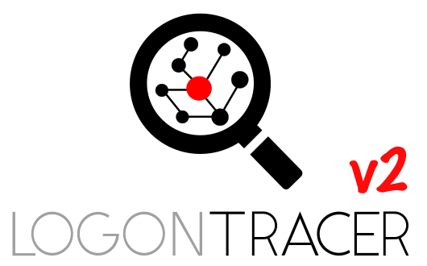</div>

[](https://github.com/JPCERTCC/LogonTracer/releases) [](https://hub.docker.com/r/jpcertcc/docker-logontracer/) 

## Concept

**LogonTracer v2** is a tool to investigate malicious logon by visualizing and analyzing Windows Active Directory event logs. This tool associates a host name (or an IP address) and account name found in logon-related events and displays it as a graph. This way, it is possible to see in which account login attempt occurs and which host is used.

This tool can visualize the following event IDs related to Windows logon.

| Event ID | Description |
|----------|-------------|
| **4624** | Successful logon |
| **4625** | Logon failure |
| **4662** | An operation was performed on an object |
| **4672** | Assign special privileges |
| **4719** | System audit policy was changed |
| **4720** | A user account was created |
| **4726** | A user account was deleted |
| **4728 / 4732 / 4756** | A member was added to a security-enabled group |
| **4729 / 4733 / 4757** | A member was removed from a security-enabled group |
| **4768** | Kerberos Authentication (TGT Request) |
| **4769** | Kerberos Service Ticket (ST Request) |
| **4776** | NTLM Authentication |
| **5137** | A directory service object was created |
| **5141** | A directory service object was deleted |

More details are described in the following documents:
- [Visualise Event Logs to Identify Compromised Accounts - LogonTracer -](http://blog.jpcert.or.jp/2017/11/visualise-event-logs-to-identify-compromised-accounts---logontracer-.html)
- [イベントログを可視化して不正使用されたアカウントを調査](https://www.jpcert.or.jp/magazine/acreport-logontracer.html) (Japanese)

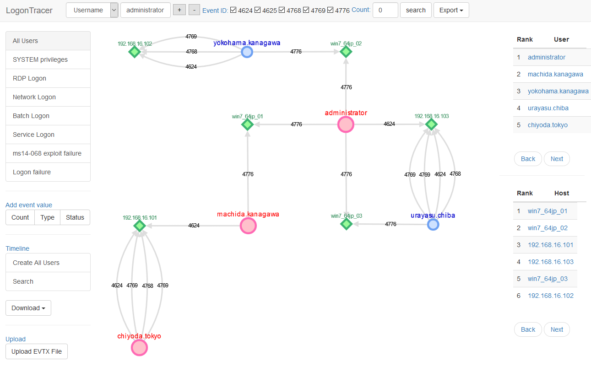

---

## What's New in Version 2.0

### AI-Powered Security Analysis
LogonTracer v2.0 integrates an AI analysis engine using OpenAI GPT models to provide intelligent threat detection beyond traditional rule-based approaches.

- **Security Pattern Analysis** — Automatically interprets graph query results and generates risk assessments with MITRE ATT&CK tactic mapping
- **Autonomous LLM Agent** — An iterative AI agent that autonomously generates and executes Cypher queries against the Neo4j graph to discover threats without manual intervention
- **AI-Generated Sigma Rules** — Converts AI analysis findings into deployable Sigma detection rules
- **Multi-language Support** — AI responses can be generated in English, Japanese, or French

### Sigma Rule Integration
- **Bundled Sigma Rules** — Includes the full [SigmaHQ](https://github.com/SigmaHQ/sigma) rule set for scanning EVTX files
- **Sigma Scan on Upload** — Optionally run Sigma rule scanning automatically during EVTX file upload
- **Sigma Rescan API** — Re-scan previously uploaded EVTX files with a specific Sigma rule folder via REST API
- **Sigma Results View** — Dedicated UI page displaying Sigma detection results in an interactive table

---

## Additional Analysis

LogonTracer uses [PageRank](https://en.wikipedia.org/wiki/PageRank), [Hidden Markov Model](https://en.wikipedia.org/wiki/Hidden_Markov_model), and [ChangeFinder](https://pdfs.semanticscholar.org/c5bc/7ca31914d3cdfe1b2932cbc779875e645bbb.pdf) to detect malicious hosts and accounts from event logs.

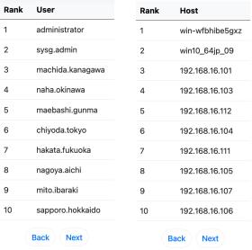

With LogonTracer, it is also possible to display event logs in chronological order.

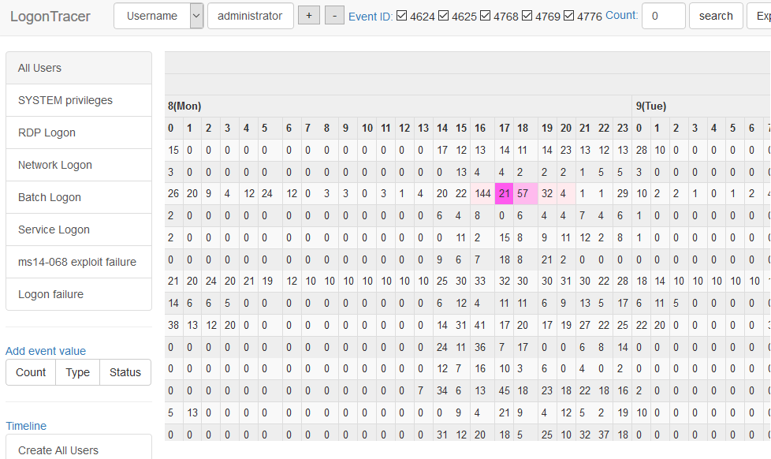

---

## Requirements

- Python 3.9 or later (3.12 recommended)
- Neo4j 5.x (Community or Enterprise)
- OpenAI API key (optional — required only for AI analysis features)

- Python modules

```
numpy
evtx
lxml
scipy
changefinder
flask
hmmlearn>=0.2.8
scikit-learn
elasticsearch-dsl>=7.0.0,<8.0.0
pyyaml
flask-sqlalchemy
flask-login
flask_wtf
flask-limiter
wtforms
GitPython
pysigma>=0.11.0
pysigma-backend-sqlite
openai>=1.0.0
aiohttp
neo4j
```

---

## Installation

### 1. Clone the repository

```shell
git clone https://github.com/JPCERTCC/LogonTracer.git
cd LogonTracer
```

### 2. Install dependencies

```shell
pip3 install -r requirements.txt
```

### 3. Start Neo4j

Download and start [Neo4j](https://neo4j.com/download/). Set the initial password and note the Bolt port (default: `7687`).

### 4. Edit the configuration file

```shell
vi config/config.yml
```

Key settings:

```yaml
settings:
  logontracer:
    WEB_PORT: "8080"
    default_user: "neo4j"       # Neo4j username for the default LogonTracer account
    default_password: "password" # Change this before first run

  neo4j:
    NEO4J_USER: "neo4j"
    NEO4J_PASSWORD: "password"   # Your Neo4j password
    NEO4J_SERVER: "localhost"
    WS_PORT: "7687"
```

### 5. Start the web application

```shell
python3 logontracer.py --run
```

Open your browser at `http://localhost:8080`.

---

## Usage

### Importing Event Logs

#### Import EVTX file(s)

```shell
python3 logontracer.py -e <path/to/Security.evtx> -z <UTC offset> -s <Neo4j server> -u <user> -p <password>
```

#### Import XML file(s)

```shell
python3 logontracer.py -x <path/to/event.xml> -z <UTC offset> -s <Neo4j server> -u <user> -p <password>
```

#### Import from Elasticsearch

```shell
python3 logontracer.py --es -s <Neo4j server> -u <user> -p <password> --es-server <ES host:port>
```

#### Import with Sigma scanning

Add the `--sigma` flag to run Sigma rule detection during import:

```shell
python3 logontracer.py -e <path/to/Security.evtx> -z 9 -s localhost -u neo4j -p password --sigma
```

#### Add additional logs (without deleting existing data)

```shell
python3 logontracer.py -e <path/to/Security.evtx> -z 9 -s localhost -u neo4j -p password --add
```

### Web GUI Upload

After starting the web application, click **Upload Event Log** in the left sidebar. You can:
- Select one or more EVTX or XML files
- Choose the UTC offset for the log timezone
- Enable **Add additional files** to append data without clearing the database
- Enable **Run scan using Sigma rules** to run Sigma detection automatically after import

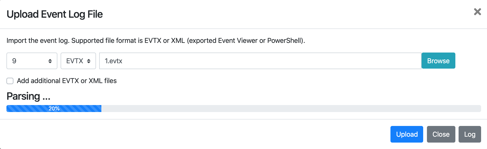

### Sigma Scan Results

After uploading with Sigma scanning enabled, or after triggering a rescan via the API, click **Sigma Scan Results** in the sidebar to view findings.

### AI Analysis (v2.0)

#### Setup

1. Go to **Settings → AI Settings** in the navigation bar
2. Enable AI analysis and enter your OpenAI API key
3. Select the GPT model and preferred response language

#### Using AI Analysis

- Click **AI Analysis** in the top navigation to run the autonomous LLM agent
- The agent iteratively generates Cypher queries, executes them against the Neo4j database, and reports discovered threats
- Click **AI History** to view the last analysis result
- From the AI analysis result panel, click **Generate Sigma Rules** to convert findings into Sigma detection rules

---

## Web Application Screenshots

### Login
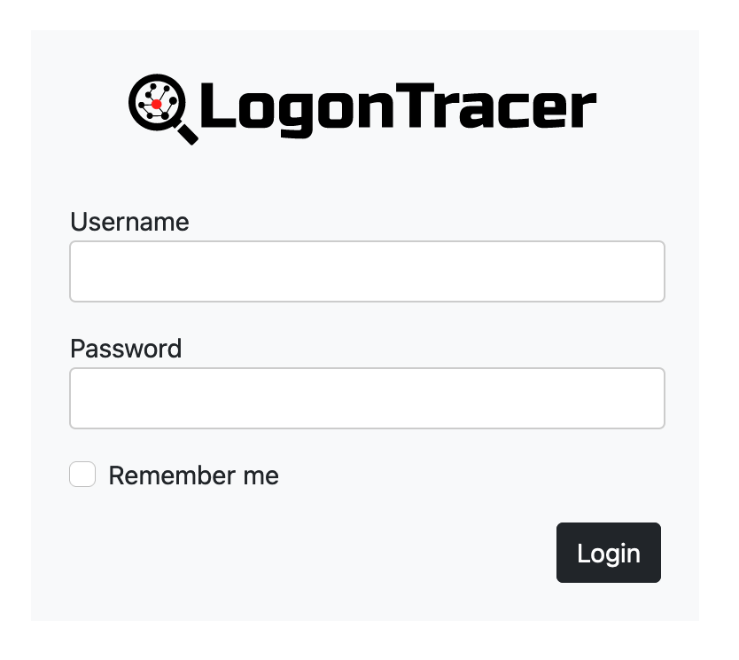

### Main Graph View


### Dark Mode
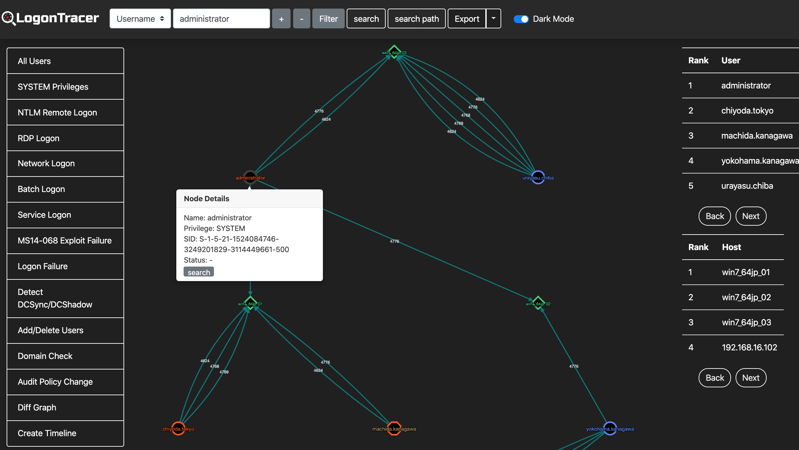

### Timeline


### Navigation Bar
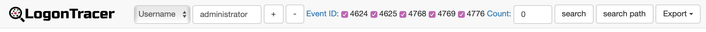

### Side Bar
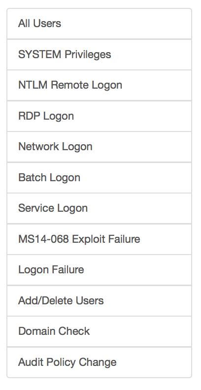

### Filter Panel
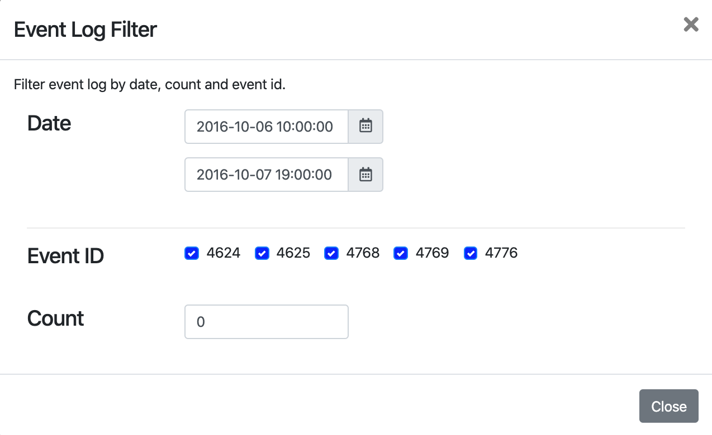

### Diff Graph
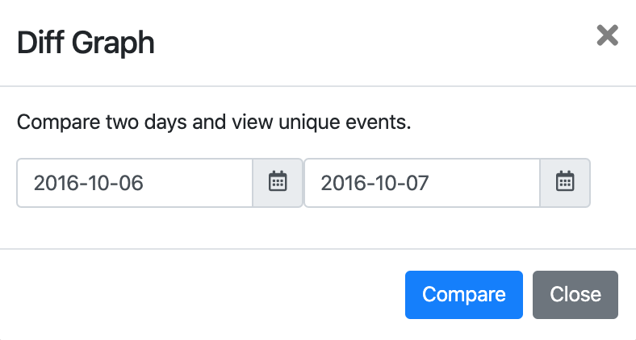

---

## Case Management (Neo4j Enterprise)

With Neo4j Enterprise Edition, LogonTracer supports multiple independent investigation cases — each stored in a separate Neo4j database.

- **Add New Case** — Create a new database for a new investigation
- **Delete Case** — Remove a case database
- **Add/Delete Access to Case** — Grant or revoke per-user access to specific cases
- **Change Case** — Switch the active case in the current session

---

## Docker

### Using Docker (single container)

```shell
docker run \
  --detach \
  --publish=7474:7474 --publish=7687:7687 --publish=8080:8080 \
  -e LTHOSTNAME=<IP Address> \
  jpcertcc/docker-logontracer
```

### Using Docker Compose

```shell
cd docker-compose
docker compose build
docker compose up -d
```

### Using Docker Compose with HTTPS (nginx)

```shell
cd docker-compose-with-nginx
docker compose build
docker compose up -d
```

### Using Docker Compose with Elastic Stack

```shell
cd docker-compose-with-elasticstack
docker compose build
docker compose up -d
```

---

## Command Line Options

| Option | Description |
|--------|-------------|
| `-r`, `--run` | Start the web application |
| `-o PORT` | Web application port (default: 8080) |
| `--host HOST` | Bind address (default: 0.0.0.0) |
| `-e EVTX [...]` | Import EVTX file(s) |
| `-x XML [...]` | Import XML event log file(s) |
| `-s SERVER` | Neo4j server address (default: localhost) |
| `-u USER` | Neo4j username (default: neo4j) |
| `-p PASSWORD` | Neo4j password |
| `--wsport PORT` | Neo4j Bolt port (default: 7687) |
| `-z UTC` | Timezone offset (e.g. `9` for JST) |
| `-f DATE` | Parse logs from this datetime (e.g. `2024-01-01T00:00:00`) |
| `-t DATE` | Parse logs to this datetime |
| `--add` | Append data without clearing the database |
| `--delete` | Clear the database before importing |
| `--sigma` | Run Sigma rule scanning during import |
| `--sigma-only` | Run Sigma scan only (no Neo4j processing) |
| `--sigma-rules PATH` | Path to Sigma rules folder (default: `sigma`) |
| `--es` | Import data from Elasticsearch |
| `--postes` | Post analysis results to Elasticsearch |
| `--es-server HOST:PORT` | Elasticsearch server |
| `--es-index INDEX` | Elasticsearch index (default: `winlogbeat-*`) |
| `--es-prefix PREFIX` | Elasticsearch event prefix (default: `winlog`) |
| `--case NAME` | Case name for Neo4j Enterprise multi-database mode |
| `-c FILE` | Configuration file path (default: `config/config.yml`) |
| `--create_user USER` | Create a new Neo4j user |
| `--create_password PASS` | Password for the new Neo4j user |
| `--role ROLE` | Role for the new user (`admin`, `architect`, `reader`) |
| `--delete_user USER` | Delete a Neo4j user |
| `-l`, `--learn` | Run machine learning analysis (Hidden Markov Model) |

---

## Demonstration

The following [YouTube video](https://www.youtube.com/watch?v=aX-vTd7-moY) shows how to use LogonTracer.

[](https://www.youtube.com/watch?v=aX-vTd7-moY)

---

## Documentation

For more details, please check [the LogonTracer wiki](https://github.com/JPCERTCC/LogonTracer/wiki).

---

## License

[LICENSE.txt](LICENSE.txt)
